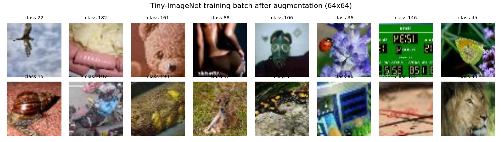
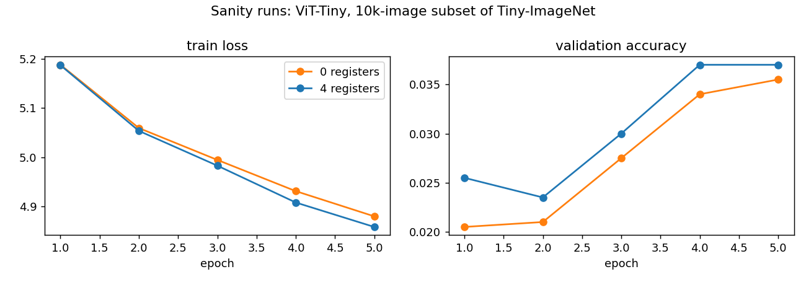
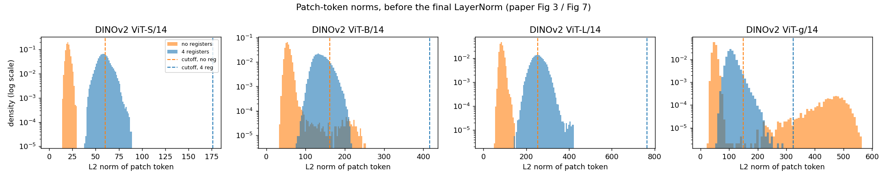
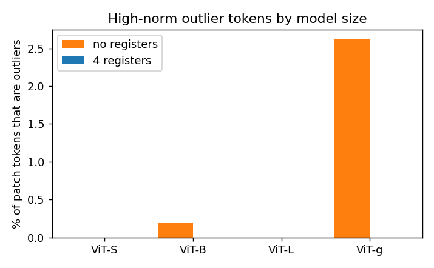
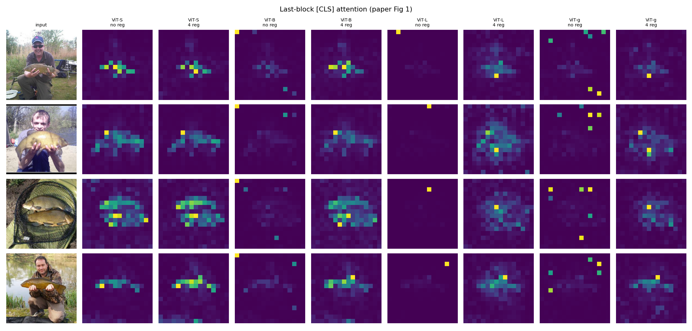
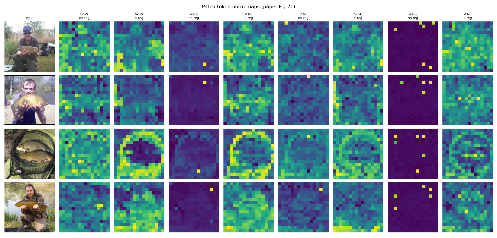
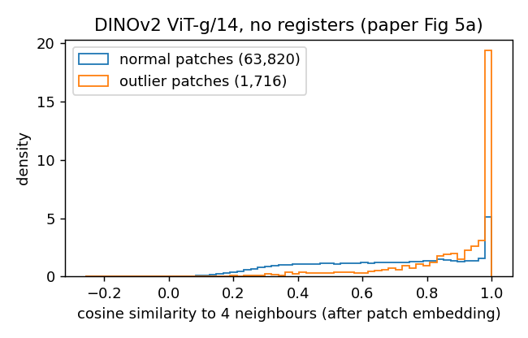
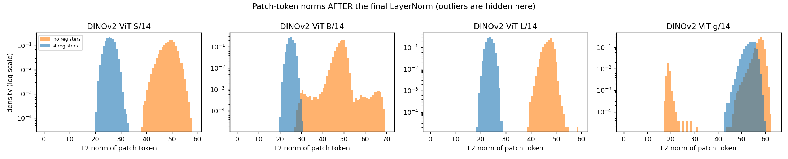

# Reproducing "Vision Transformers Need Registers"

Course project (Machine Learning, IBA Karachi): paper reproduction, experiment and deployment.

**Paper:** T. Darcet, M. Oquab, J. Mairal, P. Bojanowski. *Vision Transformers Need Registers.* ICLR 2024 (oral). [arXiv:2309.16588](https://arxiv.org/abs/2309.16588)

## 1. The paper in short

Large Vision Transformers (DINOv2, CLIP, DeiT-III) show bright spots in their attention maps on empty background areas. The authors show these spots are patch tokens with a very large norm (about 10x normal). These tokens have lost the information about their own patch and instead hold information about the whole image. Their explanation: the model needs extra space for global computation, and without any, it takes over patches it considers useless. The fix is to add a few extra learnable tokens ("registers") to the input that the model can use as scratch space. These tokens are thrown away at the output. With registers, the artifacts disappear and dense tasks improve.

## 2. What this repository does

| Part | What | Status |
|---|---|---|
| **A** | Reproduce the paper's diagnostic findings (Fig 1, 3, 4c, 5a, 7, 15) on the **official pretrained DINOv2 models**, with and without registers. No training needed. | Done: `scripts/run_part_a.py`, results in section 6 |
| **B** | **Our own ViT implementation with a register option**, a Tiny-ImageNet data pipeline, and a training script. Train small ViTs with 0 vs 4 registers. | Pipeline, model and forward pass done. Full training runs in Week 4. |
| Experiment | *At what model size do high-norm artifacts appear, and do registers change anything below that size?* | Week 4 |
| Deployment | FastAPI app: upload an image, see attention maps without vs with registers | Week 5 |

## 3. Repository structure

The code follows the ML pipeline, one file per stage:

```
src/
├── data.py        1. Data: download Tiny-ImageNet, preprocess, batch
├── vit.py         2. Model: our Vision Transformer with optional registers
├── train.py       3. Training + evaluation (AdamW, warmup + cosine LR, mixed precision, CSV logs)
├── analysis.py    4. Measurements from the paper: token norms, neighbour similarity, attention maps
├── plots.py       5. Figures
├── report.py      6. Writes results into this README
└── utils.py          Shared helpers (random seed, device, parameter count)

scripts/
├── check_forward_pass.py   Week 3 check: data -> model -> loss -> gradients (24 checks)
└── run_part_a.py           Part A: analysis of pretrained DINOv2 models

tests/                      Unit tests for the model and the measurements
notebooks/milestone2_colab.ipynb   Runs everything on Google Colab
results/
├── figures/     all plots
├── logs/        forward pass check report
├── part_a/      Part A numbers (summary.md, summary.json)
└── runs/        training logs (config.json, log.csv, final.json)
requirements.txt        minimum library versions
requirements-lock.txt   exact versions used on Colab (created by the notebook)
PROVENANCE.md           where every piece of code came from
```

## 4. How to run

**Easiest: Google Colab.** Open `notebooks/milestone2_colab.ipynb` in Colab, choose a T4 GPU runtime, and run all cells (about 30–40 min).

**By hand** (always from the repo root):

```bash
pip install -r requirements.txt
python -m pytest                                  # unit tests
python -m scripts.check_forward_pass              # downloads Tiny-ImageNet, checks data + forward pass
python -m scripts.run_part_a --sizes S,B,L,g      # Part A (GPU recommended)
python -m src.train --size tiny --registers 4 --epochs 50 --out results/runs/tiny_reg4   # a full training run
```

Every script has a quick code-test mode that uses random data instead of downloads (`--fake` or `--smoke`).

## 5. Part B: our ViT with registers

**Token sequence inside the transformer:**

```
[CLS] [REG_1] [REG_2] [REG_3] [REG_4] [PATCH_1] ... [PATCH_64]
  │      └──── learnable, no position ────┘  └─ 8x8 patches of a 64x64 image
  │           embedding, discarded at output
  └── used for classification
```

**Design choices:**

| Choice | Value | Why |
|---|---|---|
| Dataset | Tiny-ImageNet (100k train / 10k val, 200 classes, 64x64) | Freely downloadable, small enough for a free T4, 200 classes is harder than CIFAR. The official val set is our test set because test labels are not public. |
| Patch size | 8 → 8x8 = 64 patch tokens | Standard choice for 64x64 images |
| Model size | ViT-Tiny: 192-dim, 12 layers, 3 heads (5.4M params). Small and Base are also available for the Week 4 experiment. | Trains in reasonable time on a free GPU |
| Number of registers | 0 (baseline) and 4 | The paper uses 4 in all its main experiments (Sec 3.2) |
| Register placement | After the position embeddings, between [CLS] and patches, with no position embedding | Same as the official DINOv2 implementation |
| Register init | Normal, std 1e-6 (same as [CLS]) | Same as the official DINOv2 implementation |
| Output | Registers discarded; [CLS] → linear head | As in the paper (Fig 6) |
| Training | AdamW (lr 1e-3, wd 0.05), 5 warmup epochs + cosine decay, label smoothing 0.1, stochastic depth 0.1, random-resized-crop + flip, mixed precision | Standard DeiT-style recipe for training ViTs from scratch on small data |

### Forward pass check (Week 3 milestone)

Output of `python -m scripts.check_forward_pass` on the real dataset:

<!-- FORWARD_CHECK_START -->
Data: Tiny-ImageNet. Model: ViT-Tiny (192-dim, 12 blocks, 3 heads, 8x8 patches, 64 patch tokens). Batch size 64. Device `cuda` (Tesla T4), Python 3.13.15, torch 2.11.0+cu128.

| Check | Result | Detail |
|---|---|---|
| Train set size | PASS | 100,000 images |
| Val set size | PASS | 10,000 images |
| Train batch shape | PASS | (64, 3, 64, 64) |
| Val batch shape | PASS | (64, 3, 64, 64) |
| Labels in [0, 199] | PASS | min 0, max 197 |
| Pixels normalised (mean near 0, std near 1) | PASS | mean -0.110, std 1.170 |
| [0 reg] logits shape | PASS | (64, 200) |
| [0 reg] loss is finite | PASS | 5.3739 |
| [0 reg] starting loss close to ln(200) | PASS | 5.374 vs 5.298 |
| [0 reg] every parameter gets a finite gradient | PASS |  |
| [0 reg] sequence length = 1 + R + 64 | PASS | 65 = 1 + 0 + 64 |
| [0 reg] registers split off at output | PASS | reg (64, 0, 192), patch (64, 64, 192) |
| [0 reg] attention weights sum to 1 | PASS | attention shape (64, 3, 65, 65) |
| [0 reg] step-by-step attention == fast attention | PASS | max difference 4.8e-07 |
| [4 reg] logits shape | PASS | (64, 200) |
| [4 reg] loss is finite | PASS | 5.2905 |
| [4 reg] starting loss close to ln(200) | PASS | 5.291 vs 5.298 |
| [4 reg] every parameter gets a finite gradient | PASS |  |
| [4 reg] registers receive gradient | PASS | grad norm 2.59e+00 |
| [4 reg] sequence length = 1 + R + 64 | PASS | 69 = 1 + 4 + 64 |
| [4 reg] registers split off at output | PASS | reg (64, 4, 192), patch (64, 64, 192) |
| [4 reg] attention weights sum to 1 | PASS | attention shape (64, 3, 69, 69) |
| [4 reg] step-by-step attention == fast attention | PASS | max difference 9.5e-07 |
| Registers add exactly R x 192 parameters | PASS | 5,427,080 -> 5,427,848 (+768) |

**24/24 checks passed.**
<!-- FORWARD_CHECK_END -->



**Sanity training runs** (10k-image subset, 5 epochs, 0 vs 4 registers). These only show that the training loop learns. They are not results.



## 6. Part A: reproducing the paper's findings on pretrained DINOv2

We load Meta's released DINOv2 checkpoints (ViT-S/B/L/g with patch size 14, each with and without 4 registers). We run them on 256 Imagenette validation images, and measure:

| Paper claim | Paper evidence | Our evidence | Matches paper? |
|---|---|---|---|
| Some patch tokens have a much larger norm (two separate humps in the histogram) | Fig 3 | `part_a_norm_histograms.png` | **Yes.** ViT-g: 2.62% of tokens above 150 (paper: 2.37%) |
| Registers remove the outliers | Fig 7 | histograms + table below | **Yes.** ViT-g: 2.62% → 0.00% |
| Outliers sit on patches that are very similar to their neighbours | Fig 5a | `part_a_neighbour_cosine.png` | **Yes.** ViT-g: 0.871 vs 0.662 for normal patches |
| Registers give clean attention maps | Fig 1, 19 | `part_a_attention_maps.png` | **Yes** |
| With registers, the high norms move into the register tokens | Fig 15 | register-norm table below | **Yes.** ViT-g: one register at 1389.6 vs 107.8 for a typical patch |
| The outliers appear only in larger models | Fig 4c | `part_a_outliers_by_size.png` | **Partly.** Only ViT-g (and a tiny tail in ViT-B); the paper also finds them in ViT-L |

**How we find outliers:** We use the L2 norm (vector length) of each patch token at the output of the last transformer block, **before the model's final LayerNorm**. The final LayerNorm rescales every token to a similar length, which hides the outliers; our first run measured after it and found none (see `part_a_norm_histograms_after_layernorm.png`). A token is an outlier if its norm is more than 3 times the median norm of the same model. We judge each model against its own typical token because different models have very different typical norms. For ViT-g we also apply the paper's own hand-picked cutoff of 150.

**How we get attention maps:** A hook captures the input to the last attention layer. We recompute `softmax(q·kᵀ/√d)` and take the [CLS] row over the patch tokens, averaged over heads. We checked this against the DINOv2 module: recomputing the full attention output this way matches the module's own output to within 1e-7.

<!-- PART_A_START -->
Setup: official DINOv2 checkpoints (torch.hub), 256 Imagenette validation images at 224x224 (256 patches each). Norms are measured on the output of the last transformer block, before the final LayerNorm. An outlier is a patch token whose norm is more than 3 x the median norm of the same model.

| Model | Median norm (no reg / 4 reg) | Max norm (no reg / 4 reg) | % outliers, no reg | % outliers, 4 reg | Neighbour similarity, outlier vs normal (no reg) |
|---|---|---|---|---|---|
| ViT-S/14 | 20.1 / 58.8 | 29.7 / 88.6 | 0.00% | 0.00% | n/a vs 0.615 |
| ViT-B/14 | 53.9 / 138.9 | 252.2 / 216.8 | 0.20% | 0.00% | 0.884 vs 0.608 |
| ViT-L/14 | 84.7 / 254.8 | 145.2 / 420.4 | 0.00% | 0.00% | n/a vs 0.502 |
| ViT-g/14 | 49.6 / 107.8 | 560.6 / 286.7 | 2.62% | 0.00% | 0.871 vs 0.662 |

With the paper's own cutoff (norm > 150) on ViT-g: **2.62%** of patch tokens without registers (paper reports 2.37%). This cutoff is only meaningful for the no-register model, which is what the paper applied it to.

Why before the final LayerNorm: the LayerNorm rescales every token to a similar length. Largest token norm divided by the median norm:

| Model | before LayerNorm (no reg / 4 reg) | after LayerNorm (no reg / 4 reg) |
|---|---|---|
| ViT-S/14 | 1.48x / 1.51x | 1.17x / 1.28x |
| ViT-B/14 | 4.68x / 1.56x | 1.41x / 1.20x |
| ViT-L/14 | 1.71x / 1.65x | 1.24x / 1.19x |
| ViT-g/14 | 11.30x / 2.66x | 1.08x / 1.11x |

Average norms in the register models, before the final LayerNorm (where do the high norms go? cf. paper Fig 15b):

| Model | [CLS] | reg_0 | reg_1 | reg_2 | reg_3 | median patch |
|---|---|---|---|---|---|---|
| ViT-S/14 + reg | 42.7 | 43.9 | 159.8 | 42.4 | 40.1 | 58.8 |
| ViT-B/14 + reg | 132.7 | 104.5 | 230.1 | 104.5 | 284.5 | 138.9 |
| ViT-L/14 + reg | 196.7 | 762.2 | 128.1 | 170.0 | 170.4 | 254.8 |
| ViT-g/14 + reg | 150.9 | 299.2 | 150.7 | 1389.6 | 64.4 | 107.8 |

Figures: `results/figures/part_a_*.png`
<!-- PART_A_END -->








### What Part A shows

- **High-norm tokens (Fig 3): reproduced.** Without registers, ViT-g's patch-token norms form two separate humps: most tokens sit below 150, and a small group sits between roughly 300 and 560. 2.62% of tokens are above the paper's cutoff of 150; the paper reports 2.37%.
- **Registers remove them (Fig 7): reproduced.** With registers, ViT-g has no second hump and 0.00% outliers. The same holds for every model size.
- **Outliers sit on redundant patches (Fig 5a): reproduced.** Right after the patch embedding, ViT-g's outlier patches have an average similarity of 0.871 to their neighbours, against 0.662 for normal patches, with a sharp peak at 1.0 as in the paper. In ViT-B it is 0.884 vs 0.608.
- **Clean attention maps (Fig 1): reproduced.** Without registers, ViT-B, L and g show bright spots on background patches, often at the image edges. With registers, attention sits on the object. ViT-S is clean in both versions, in line with the paper's finding that small models don't have artifacts. The norm maps (Fig 21) show high-norm spots at the same positions as the attention spots.
- **High norms move into the registers (Fig 15): reproduced.** In every register model, one register has a clearly larger norm than a typical patch token. For example, ViT-g's reg_2 is at 1389.6 against 107.8 for the median patch, and ViT-L's reg_0 is at 762.2 against 254.8. As in the paper, the registers differ from each other.
- **Model size (Fig 4c): partly reproduced.** Clear high-norm outliers appear only in ViT-g; ViT-B has a very small tail (0.20%), and S and L have none. The paper finds outliers from ViT-L upwards. A likely reason: Meta's released S, B and L models were distilled from ViT-g, whereas the paper's Fig 4c trains each size on its own. ViT-L still shows attention-map artifacts, so the behaviour is weakened in it rather than fully absent.
- **The final LayerNorm hides the outliers.** In ViT-g the largest token is 11.3x the median norm before the final LayerNorm, but only 1.08x after it. The paper's norms must therefore be measured before this layer, which is what we do.

## 7. Differences from the paper

**Changes from our proposal**

- We use only DINOv2, not CLIP. Meta released DINOv2 models trained both with and without registers, but no CLIP model with registers exists publicly, so a before/after comparison is only possible for DINOv2.
- We load the models from Meta's official repository through PyTorch Hub instead of HuggingFace. These are the same weights from the original source.
- For Part A we use Imagenette validation images (object-centred photos, similar to the paper's figures), since the DINOv2 models expect larger images than Tiny-ImageNet's 64x64.

**Differences from the paper's setup**

- **Model sizes in Part A:** The paper's Fig 4c compares DINOv2 models trained separately at each size. Meta's *released* ViT-S/B/L were distilled from ViT-g, so the size trend in our Part A is measured on distilled models. This may differ from the paper's trend.
- **Images:** 256 Imagenette validation images at 224x224 (16x16 patches), not the paper's image set or resolution.
- **Outlier cutoff:** a fixed relative rule (3 × the model's median norm) instead of a hand-picked value per model. For ViT-g we also report the paper's cutoff of 150.
- **Part B scale:** ViTs with 5–86M parameters trained from scratch on 64x64 images for tens of epochs. The paper trains ViT-B/L on ImageNet-22k or larger datasets for much longer. The paper reports that artifacts only appear in large, long-trained models (Fig 4), so our small models may show no artifacts at all. This is what our Week 4 experiment tests.

## 8. Next steps

- **Week 4:** full 50-epoch runs, ViT-Tiny with 0 vs 4 registers (accuracy, norm histograms, attention maps). Then the scaling experiment: Tiny / Small / Base, with vs without registers.
- **Week 5:** FastAPI deployment, final report and presentation.

## 9. Provenance

See [PROVENANCE.md](PROVENANCE.md) for a file-by-file record of what was written for this project, what was adapted, and what was reused.

## References

- Darcet et al. *Vision Transformers Need Registers.* ICLR 2024.
- Oquab et al. *DINOv2: Learning Robust Visual Features without Supervision.* TMLR 2024. Code and weights: https://github.com/facebookresearch/dinov2
- Dosovitskiy et al. *An Image is Worth 16x16 Words: Transformers for Image Recognition at Scale.* ICLR 2021.
- Touvron et al. *Training data-efficient image transformers & distillation through attention (DeiT).* ICML 2021.
- Le & Yang. *Tiny ImageNet Visual Recognition Challenge.* CS231N, 2015.
- Imagenette: https://github.com/fastai/imagenette
